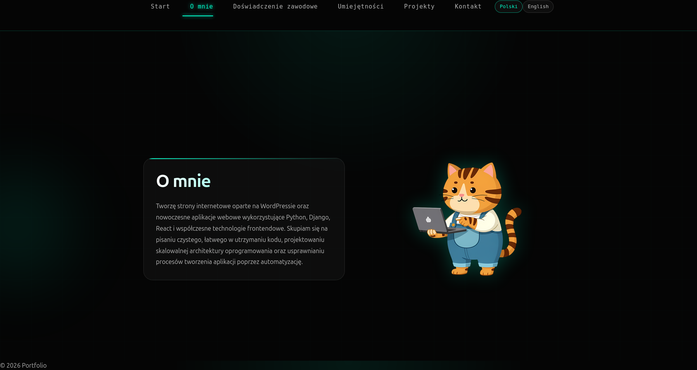
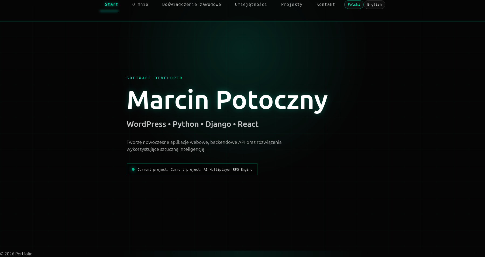
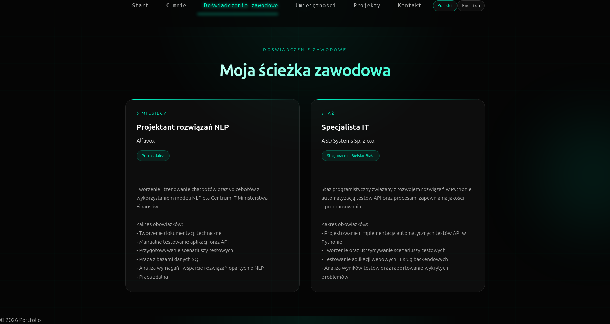
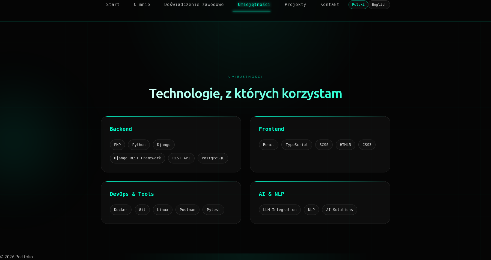
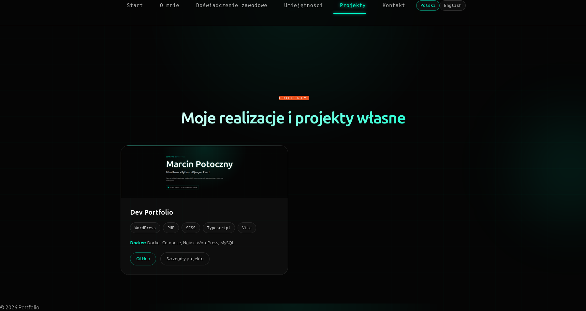
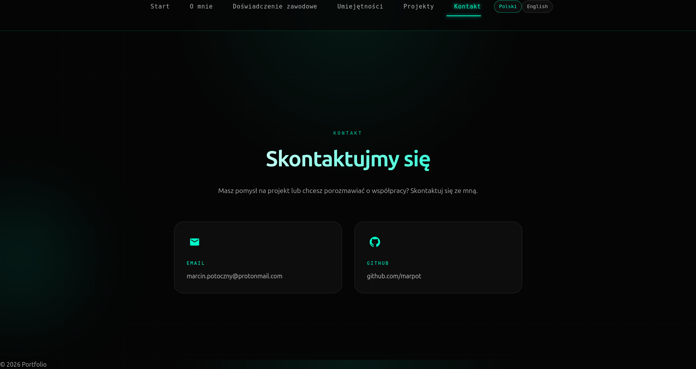

```md
# 🚀 Dev Portfolio — Custom WordPress Theme


# 🧑‍💻 About the project

A custom WordPress portfolio theme developed from scratch.

The project presents a modern developer portfolio website built with a custom WordPress architecture, modern frontend tooling and CMS-based content management.

The main goal was to create a professional portfolio platform where all content can be managed directly from WordPress administration.

---

# ✨ Features

## 🎨 Frontend

- ⚡ Modern responsive full-page portfolio layout
- 🌌 Animated background effects
- 🧩 Modular SCSS architecture
- 🎯 Smooth section navigation
- 🔥 Active navigation highlighting using Intersection Observer
- 📱 Responsive mobile design
- 🎨 Custom project detail pages


---

## 📝 WordPress CMS

- Custom WordPress theme created from scratch
- Custom Post Types:
  - Projects
  - Experience
- Advanced Custom Fields (ACF) integration
- Dynamic portfolio sections
- Editable project information:
  - description
  - technologies
  - GitHub links
  - Docker information
- Experience timeline management
- Template parts architecture
- Polylang multilingual support


---

# 🛠 Developer Experience

- 🐳 Docker Compose local environment
- 📦 npm asset pipeline
- ⚡ Vite frontend bundling
- 🎨 SCSS preprocessing
- 🧱 Clean theme structure
- 🔧 Separation of PHP logic into modules


---

# 🧰 Tech Stack

## Backend / CMS

| Technology | Purpose |
|-|-|
| 🟦 WordPress | CMS |
| 🐘 PHP | Theme development |
| 🔌 ACF | Custom fields |
| 🌍 Polylang | Multilingual support |


## Frontend

| Technology | Purpose |
|-|-|
| HTML5 | Structure |
| SCSS | Styling architecture |
| TypeScript | Interactive features |
| Vite | Asset bundling |


## Environment

| Technology | Purpose |
|-|-|
| Docker | Development environment |
| Docker Compose | Container orchestration |
| MySQL | Database |


---

# 📂 Project Structure

```

wp-projects/

├── docker-compose.yml
├── Makefile
├── README.md
│
└── themes/
│
└── dev-portfolio/
│
├── functions.php
├── single-project.php
├── header.php
├── footer.php
│
├── inc/
│   ├── setup.php
│   ├── custom-post-types.php
│   ├── assets.php
│   └── helpers.php
│
├── template-parts/
│   ├── sections/
│   └── projects/
│
├── js/
│   └── TypeScript files
│
├── scss/
│   ├── base/
│   ├── components/
│   ├── layout/
│   ├── sections/
│   └── utils/
│
└── screenshots/
├── hero.png
├── about.png
├── experience.png
├── skills.png
├── projects.png
└── contact.png

````

---

# 🚀 Installation

## Requirements

- Docker
- Docker Compose
- Node.js
- npm


## Clone repository

```bash
git clone https://github.com/marpot/wordpress-portfolio-theme.git
````

## Start WordPress environment

```bash
docker compose up
```

## Install frontend dependencies

```bash
npm install
```

## Start Vite development server

```bash
npm run dev
```

---

# 🔮 Future improvements

Possible future extensions:

* [ ] Contact form integration
* [ ] Deployment configuration
* [ ] Performance optimization
* [ ] SEO improvements
* [ ] Additional portfolio animations

---

# 📸 Screenshots

## Hero



## About Me



## Experience



## Skills



## Projects



## Contact



---

# 👨‍💻 Author

**Marcin Potoczny**

Software Developer interested in:

* Python / Django
* React
* WordPress Development
* AI integrations
* Game development

GitHub:

[https://github.com/marpot](https://github.com/marpot)

---

⭐ If you like this project, feel free to give it a star.

````
